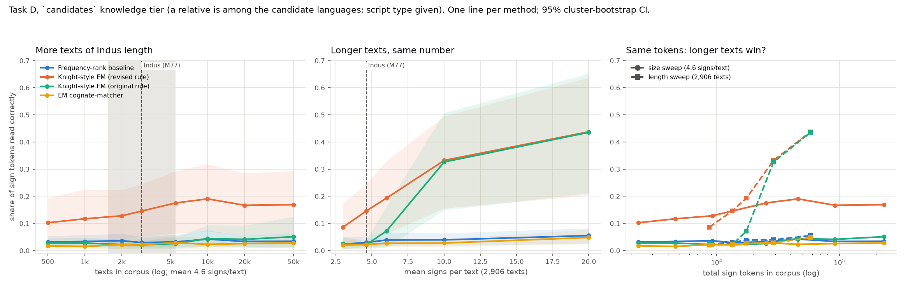

# IBDB: Indus Blind Decipherment Benchmark

**Question.** Suppose a corpus has the statistics of the Indus inscriptions: a few thousand
texts, about 4-5 signs each, 400-700 sign types, strong positional effects. Could any existing
decipherment method recover the language underneath? If not, how much more data would it need?

**What IBDB does.** It writes *known* languages (Sanskrit, Old Tamil, Sumerian, Latin, Finnish)
and *non-linguistic* sign systems in invented scripts. It calibrates those scripts to published
Indus statistics and hides the answer key. Then it measures which methods recover what, at
which corpus size.

**What IBDB does not do.** It does not decipher the Indus script, and it makes no claim
about the Indus language. A method that scores well here has shown it can read Indus-*like*
synthetic data. That is a necessary condition for a credible decipherment, not evidence of one.



## Results at a glance

All numbers are for synthetic Indus-like corpora (2,906 texts, mean 4.6 signs). None of them
measures the Indus script itself.

1. **Indus decipherability is underdetermined.** Two corpus properties that published Indus
   statistics leave open dominate difficulty: the share of duplicate texts and the number of
   sign variants. Inside the range bracketed by published values (duplicates 0.2-0.4,
   inventory 400-700), with a related language among the candidates, the best method recovers
   8.7% to 21.8% of sign tokens depending on the cell. Within one language and script, accuracy
   moves by up to 62 points, and by 10 points or more for 4 of 10 combinations. Any single
   difficulty number is unreliable. This dependence appears only when a relative is available
   (see 3). Inventory is varied only through allographs, and no tested method merges allographs.
   See [`reports/sensitivity/sensitivity.md`](reports/sensitivity/sensitivity.md).
2. **Entropy statistics do not separate synthetic languages from i.i.d. signs at Indus scale**
   (plug-in entropy ratio about 0.47 for both). Under the holdout calibration regime, the Rao-style
   entropy classifier is not distinguishable from chance: balanced accuracy 0.57 [0.32, 0.81],
   and 0.49 on fresh seeds.
3. **Without a related language among the candidates, no tested method exceeds about 5% of
   tokens.** This holds across the published range. The best cell anywhere on the
   sensitivity grid reaches 7.1%, and no corpus reaches 50%.
4. **More texts barely help.** Whether longer texts help depends on the generator.

Read [`reports/results/results.md`](reports/results/results.md) for all numbers with
confidence intervals, and [`reports/calibration_report.md`](reports/calibration_report.md)
for how closely the synthetic corpora match the Indus targets. The draft paper is
[`reports/methods_report.md`](reports/methods_report.md).

## Method in one paragraph

Plaintext comes from openly licensed corpora ([config/sources.yaml](config/sources.yaml)).
Each source is cut into short, seal-like segments: names, epithets, titles, formulae, and
19,076 real Sumerian seal inscriptions. A generator writes them in one of four script types
(logographic, syllabic, logo-syllabic, alphabetic). It can add allographs, homophony,
polyvalence, determinatives, word dividers and a reading direction. Text selection and
writing-system knobs are calibrated until the corpus matches every Indus target in
[config/indus_targets.yaml](config/indus_targets.yaml), each of which carries a citation and
a verified/unverified flag. Eight method families run on every corpus: Rao-style entropy,
Yadav-style n-grams, positional histograms, segmentation, script-type estimation,
language/non-language classifiers, Knight-style EM (under its original and revised
candidate-selection rules), and an EM cognate-matcher. Four tasks are scored separately:

| Task | Question | Chance |
|---|---|---|
| A | Is it language at all? **Status: unresolved** (see per-family false-positive rates) | 0.50 balanced accuracy |
| B | Which script type? | 0.25 |
| C | Which language family? | ~0.25 (depends on candidates) |
| D | What does each sign stand for? (token accuracy vs key) | ≈ frequency-rank baseline |

## Design safeguards (and why they exist)

An adversarial review (Believer / Skeptic / Investor / Judge) ruled **"fix first"**. The
Skeptic's fatal flaw: *if the generator's choices determine the curve, the Indus point is a
coordinate in a space we defined.* The fixes are built in:

1. **No single Indus verdict.** Results are reported across a band of corpus sizes, and as a
   *feasibility region*: the share of random writing-system scenarios in which a method
   succeeds at Indus scale.
2. **Three calibration regimes**: `full`, `holdout` (positional and frequency targets left
   free), and `wrong_prior` (deliberately wrong targets). Rank changes across regimes are
   reported, so circularity is measured rather than hidden.
3. **Structurally independent non-linguistic controls**: heraldic bearings (one sign per
   visual element), administrative slot tags, Markov emblems, Rao's type 1 and type 2, and an
   **adversarial** control tuned to match language entropy. Kamon *descriptions* are text and
   are reported separately as a contaminated control.
4. **Knowledge tiers for decipherment**: `related` (a close synthetic sister language, the
   Ugaritic/Hebrew situation, not available for Indus), `candidates`, and `none`. Only the
   last two are Indus-relevant.
5. **"Nothing works" is a first-class output**: the smallest corpus at which each method
   beats chance is tabulated.
6. **The leaderboard cannot be gamed by matching public texts.** Challenge corpora are built
   from secretly disguised sister languages. Keys are committed by SHA-256 before submissions,
   and each team gets one scored submission per hidden round.

## Choices that could make results meaningless (read before citing)

- **Oracle script type in Task D.** Decipherment methods are told the script type and the
  unit level. Real Indus decipherers are not, so Task D numbers are an *upper bound*.
- **Sister-language distance** (sound-change 0.30, lexical replacement 0.20) directly sets
  `related`-tier results. It is a free parameter, so those results are not a measurement of
  Indus.
- **Inventory calibration erases the inventory signal.** Every corpus is forced to 400-700
  signs, so script type cannot be read off inventory size by construction. That is true of
  Indus too, but it makes the inventory rule's score uninformative about the rule itself.
- **Segment selection is tuned.** Positional and frequency targets are hit by preferring
  certain windows of real text, not by modelling what seals actually said. The `holdout`
  regime shows the effect.
- **Calibration numbers were corrected.** An earlier version used 5,500 texts and mean 4.4 from
  the project brief; neither was verified. All results now use the verified Mahadevan (1977)
  figures: 2,906 texts and 13,372 sign occurrences, i.e. 4.60 signs per text. The median of 4 is
  still unverified (tolerance ±1). Plots also shade 1,548 (EBUDS) to ~5,500 texts.
- **CDLI (Sumerian) has no formal open license.** Its terms allow reuse "according to common and
  fair academic practice" with citation. Check before publishing derived Sumerian material.
- **No neural decipherment is evaluated.** The "EM cognate-matcher" borrows the one-to-one
  assignment idea of Luo, Cao & Barzilay (2019) but contains no neural network. Its results say
  nothing about neural methods.
- **Small-sample entropy bias.** On the final run, an i.i.d. 420-sign control (true
  H(X2|X1)/H(X1) = 1) measures 0.47 at the Indus point (2,906 texts) with the full alphabet, and
  0.70 with Rao's top-100 merge. It reaches 0.83 at 50,000 texts. Synthetic languages at the Indus
  point average 0.48 on the same statistic, which is indistinguishable from the i.i.d. control. An
  earlier draft quoted ~0.59 from a unit-test setting (18k tokens); that figure is superseded.

## Known limitations and future work

- **The sister-language distance sweep does not measure distance.** A regular, bijective sound
  change is a relabelling of units, which a substitution solver absorbs completely. Combined with
  credit for cognate readings, this means that varying the sound-change rate barely moves Task D
  (close-relative recovery 0.28 → 0.24 from the nearest to the farthest level). Only lexical
  replacement bites. *Future work:* rebuild the synthetic relative with mergers, splits,
  conditioned (context-dependent) changes and different phonotactics, then rerun the sweep.
  Until then, `related`-tier numbers are an upper bound whose dependence on distance is unknown.
- **Text-beginner calibration.** Most generator-v1 corpora miss the Indus text-beginner target
  (82 signs cover 80% of text openings). Generator-v2 (a two-stage window sampler) is an
  attempted fix and is reported side by side with v1.
- **Sensitivity map: allographs are the only way inventory grows, and no method merges them.**
  High-inventory cells measure these solvers' failure to merge graphic variants, not
  decipherability in general. *Future work:* add an allograph-clustering step or method, and
  other ways of growing the inventory. Only 5 of 20 language x script combinations are valid in
  every grid cell (strict panel), and 10 of 20 inside the published-value box. Cells at the grid
  edges are unreachable for some scripts.
- **The calibration targets describe a pooled corpus.** M77 mixes object types and roughly 700
  years. Seals are almost all unique, while tablets are often copied or molded in duplicate
  (Kenoyer & Meadow 2010). Each sub-period may have used considerably fewer than 400-450 signs
  (Kenoyer 2020b). Subsets by object type or period would sit elsewhere on the sensitivity map;
  their predicted positions are marked there, labelled "prediction, not measurement". *Future work:* per-period and
  per-object-type targets, which need a tagged corpus we have permission to use (see
  DATA_LICENSES.md).

## How results are reported (after an adversarial review of the first draft)

- **Methods were frozen before the final run** at git tag `frozen-v1`.
- **Task D headlines use only the Indus-relevant knowledge tiers** (`candidates`, `none`). The
  close-relative tier is shown separately as an upper bound, with the sister-language distance
  swept over 4 levels, and with a run where the script type is predicted instead of given.
- **Both EM selection rules are reported.** The revised rule was adopted during development after
  the original one picked Sumerian for almost every corpus.
- **The `holdout` calibration regime leads**, and every table is repeated on the corpora that
  meet all calibration targets.
- **Confidence intervals resample whole source languages** (cluster bootstrap), because corpora
  from one language are not independent.
- **Language detection is labelled unresolved.** Read the false-positive rate per control
  family, not just the average.
- **Sumerian is excluded from published challenge rounds** until CDLI confirms its reuse terms.
  It stays in internal experiments, with citation: Cuneiform Digital Library Initiative,
  https://cdli.mpiwg-berlin.mpg.de.

## Install and reproduce

```bash
python3.11 -m pip install -e ".[dev]"
ibdb reproduce --profile full     # fetch -> prepare -> calibrate -> run -> report  (hours on 4 cores)
ibdb reproduce --profile quick    # smaller sweep for a smoke run
pytest                            # unit tests (no downloads needed)
```

Individual steps: `ibdb fetch`, `ibdb prepare`, `ibdb calibrate`, `ibdb run`, `ibdb report`.
Every random draw descends from `master_seed` in `config/experiment.yaml`.
`ibdb fetch` refuses any single download over 500 MB unless given `--allow-large`. The largest
source is 122 MB.

## How to submit to the blind challenge

1. Get a round: `challenge/public/<round>/` (keys included, for development) or
   `challenge/hidden/<round>/` (keys held by the maintainer; SHA-256 commitments in
   `commitments.json`).
2. Each `corpora/*.json.gz` holds sign-ID sequences in physical order plus the reading direction.
3. Produce one JSON file:

```json
{"team": "...", "method": "...", "url": "...", "claims_indus_decipherment": false,
 "predictions": {"<corpus_id>": {"is_linguistic": true, "script_type": "syllabic",
                                 "family": "dravidian", "sign_values": {"123456": "ka"}}}}
```

4. Score public rounds yourself: `ibdb-score sub.json --round r1 --tier public`. For hidden
   rounds, send the file to the maintainer, who runs `ibdb-score sub.json --round r1 --tier hidden --record`
   and rebuilds the static page with `ibdb leaderboard`.

**Maintainer: create hidden rounds only on a machine you control.** Run
`ibdb challenge build --round h1 --tier hidden` locally, then commit `challenge/hidden/h1/`
(corpora, manifest, commitments). Never commit `private/`: it holds the round secret and the keys.
A hidden round generated anywhere else, such as a shared or cloud session, should be treated as
compromised.

Sign values are compared as transliterated unit strings. The unit conventions are in
`ibdb/phonology.py`: IAST for Sanskrit, ISO-15919-style for Tamil, CDLI readings for Sumerian.

## Repository layout

```
config/            calibration targets (with citations), sources (with licenses), experiment profiles
src/ibdb/          package: data/ (fetch, prepare), generator/ (script, sampler, calibrate, build),
                   controls.py, methods/ (8 families), knowledge.py, evaluate.py, figures.py,
                   reports.py, challenge.py, leaderboard.py, cli.py
tests/             unit tests for generator, metrics, scoring, learners, methods
reports/           calibration report, results tables, figures, methods report
challenge/         public and hidden rounds (hidden keys are NOT here)
leaderboard/       static page (index.html) + data.json
private/           answer keys and challenge secrets; git-ignored, never published
data/              downloaded and derived text; git-ignored (licenses vary)
```

## Licenses

Code: MIT ([LICENSE](LICENSE)). Data keeps its own license and is never committed; see
[DATA_LICENSES.md](DATA_LICENSES.md).
