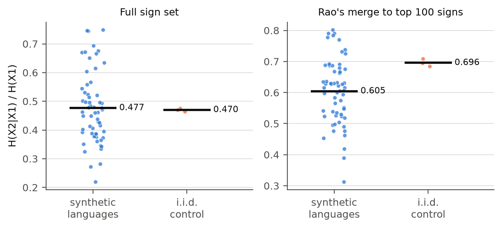
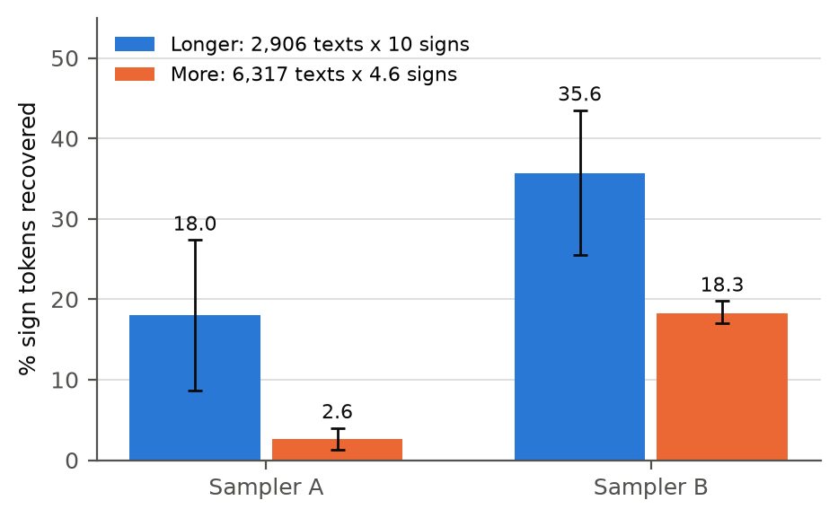
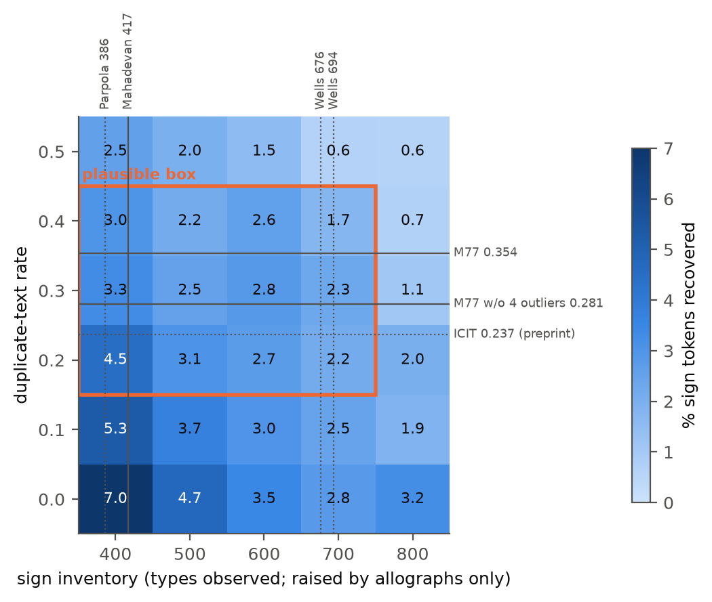

# DRAFT (for review; not for deposit)

**A Blind Benchmark of Decipherment Methods on Synthetic Scripts Calibrated to Indus Statistics**

Arnav Goel, Woodstock School, Mussoorie, India

arnavgoel@woodstock.ac.in

## Abstract

Arguments about the undeciphered Indus script often rest on methods never tested on corpora of Indus
size and shape with a known answer. We write five known languages and
several non-linguistic sign systems in invented scripts, calibrate them to published Indus
statistics (2,906 texts, 4.6 signs per text), hide the answer keys, and test eight frozen method
families at three levels of solver knowledge. Four results replicate on fresh seeds. A plug-in entropy ratio cannot tell synthetic languages from an i.i.d. random control at Indus scale. Rao et al.'s smoothed estimator separates them clearly, but places most structured non-linguistic systems, both synthetic and attested, within the range of the languages. Without a related
language among the candidates, mean recovery of sign values stays at or below 4.8% in every run. At
equal total size, longer inscriptions help more than more inscriptions, in both text samplers and in
logo-syllabic corpora. And published Indus statistics do not fix how decipherable an Indus-scale
corpus is: two samplers that the published statistics cannot tell apart differ roughly three- to fivefold when a related
language is available, and for logo-syllabic corpora only when it is the sole reference. A fifth,
archaeological result is a prediction, not a measurement. The main solver matches the best published
accuracy on English substitution ciphers. All limitations, including an optimistic synthetic relative,
few source languages and post-hoc decisions, are listed.

## Plain-language summary

The Indus script was used about 4,500 years ago in South Asia, and nobody can read it. Most inscriptions are four or five signs long, and no bilingual text exists. We
asked whether existing computer methods would work on texts like these if the answer were known. We
wrote five known languages, and some sign systems that are not language, in made-up scripts matched
to the published Indus figures, then hid the answers. A simple entropy measure could not tell synthetic
languages apart from an i.i.d. random control, in which every sign is drawn independently. The
smoothed measure of Rao et al. (2009) could, but it placed most structured non-linguistic systems among
the languages. Without a
related language, the methods recovered about 5% of signs or fewer on average. Longer inscriptions
helped more than more inscriptions. Two ways of building the collections that the published figures
cannot tell apart gave results that differed three- to fivefold when a related language was
available. This work does not decipher the Indus script or say anything about what language it
records, or whether it records a language at all.

---

## 1. Introduction

The Indus inscriptions are short. Mahadevan's (1977) concordance holds 2,906 texts with 13,372 sign
occurrences, about 4.6 signs per text (Yadav et al. 2010; Rao 2018), and the longest text is commonly
given as 17 signs on a single surface (Farmer, Sproat & Witzel 2004). Even the number of signs is
disputed: depending on how variants are grouped, published lists count from 386 to about 700 sign
types (Parpola 1994 and Wells 2015, both via Rao 2018; Mahadevan 1977; Wells 2006 via Yadav et al.
2010). No bilingual text is known, and no language of the Harappan civilisation is agreed.

Some proposals assign readings to the signs. Others use corpus statistics to argue that the signs
encode language, through conditional entropy (Rao et al. 2009) or n-gram models (Yadav et al. 2010),
or that they do not, from the brevity of the texts (Farmer, Sproat & Witzel 2004) and from the finding
that entropy-type measures do not separate writing from non-linguistic symbol systems (Sproat 2010,
2014). Both sides rely on methods that have never been tested on a corpus of Indus size and shape
whose answer is known.

We run that test. We write known languages, and sign systems that encode no language,
in invented scripts, calibrate each corpus to published Indus statistics, hide its answer key, and
measure what existing methods recover. The result is a statement about methods on Indus-like data.
This work does not decipher the Indus script or say anything about what language it records, or whether it records a language at all. Nothing in it bears on what the signs mean.

Three scope statements apply throughout. "Decipherment" here means substitution-style recovery of sign
values only, not grammar, meaning or the identity of an unknown language. And the benchmark
languages (Sanskrit, Old Tamil, Sumerian, Latin, Finnish) were chosen for licences and for spread
across families and script types; they imply nothing about the language of the Indus inscriptions,
and how well any of them is recovered says nothing about Harappan. Finally, the benchmark tests only
automated methods, and its decipherment tasks only methods that compare an unknown script with known
languages. Decipherment that analyses the script itself while reconstructing the language is not
measured.

Defining "Indus-like" turned out to be the hard part. Published statistics fix the number of texts,
their length, the sign inventory and several frequency and positional measures. They do not fix how
often texts repeat, how many sign types are variants of one another, or how text is sampled. We find
that choices these statistics leave open, here the way text is sampled, change recovery roughly
three- to fivefold when a related language is available, while duplicate rate and inventory within
one sampler matter less under the frozen rule. So we report a map, not a single Indus number.

**Findings.**

1. A plug-in entropy ratio cannot tell synthetic languages from an i.i.d. random control
   (independent, identically distributed signs) at Indus scale. Rao et al.'s smoothed estimator
   separates them clearly, but places most structured non-linguistic systems, both synthetic and
   attested, within the range of the languages.
2. Without a related language among the candidates, mean recovery stays at or below 4.8% in every
   run. No corpus reaches 50% of tokens; the best reaches 28%.
3. Under the frozen rule, longer inscriptions help more than more inscriptions in both samplers,
   logo-syllabic corpora included (Table 6).
4. Published Indus statistics do not fix how decipherable an Indus-scale corpus is. Two samplers
   that the published statistics cannot tell apart differ roughly three- to fivefold when a related language is available
   (Table 7). For logo-syllabic corpora, the most Indus-relevant type, this contrast appears only
   when the related language is the sole reference; among candidate languages it is unresolved.
5. Archaeologically defined subsets of the corpus are predicted to sit at different points on the
   map. These are predictions, not measurements.

The paper contributes a calibrated script generator with every target cited and flagged, eight
frozen method families behind one interface, a protocol scoring four tasks separately (language-level
intervals, three calibration regimes, three knowledge tiers, fresh-seed replication), a sensitivity
map with published reference points, and a blind challenge with hash-committed keys.

## 2. Related work

**Structural statistics.** Rao et al. (2009) compared conditional entropy across Indus and
reference systems and argued for linguistic structure. Yadav et
al. (2010) fitted n-gram models and reported the statistics behind most of our calibration targets.
Farmer, Sproat & Witzel (2004) argued from brevity and repetition that the signs were not writing,
and Sproat (2010, 2014) showed that entropy-type statistics do not reliably separate writing from
non-linguistic symbol systems. Lee, Jonathan & Ziman (2010) proposed an entropy-based classifier for
Pictish symbols, which we include as a method.

**Closest prior work.** Nair (2026), a preprint, tests 1,916 deduplicated ICIT inscriptions against
heraldic and administrative baseline generators and seven attested non-linguistic corpora, on four
properties from the Farmer-Sproat-Witzel critique, and places the corpus between the baselines.
Tiwari (2026) analyses 6,579 inscriptions with sign-form clustering, entropy, Kullback-Leibler
divergence and a BiLSTM, and reports directional asymmetry and structured combinatorial patterns.
Both ask what kind of sign system the real corpus is. We never touch the real corpus; we score
methods against hidden keys on synthetic corpora. Nair's ICIT duplicate rate is used only as a
reference point.

**Computational decipherment.** Knight et al. (2006) framed decipherment as unsupervised learning of
a substitution model with expectation-maximisation (EM); Berg-Kirkpatrick & Klein (2013) showed that
many random restarts help. Snyder, Barzilay & Knight (2010) recovered Ugaritic with Hebrew as a known
relative, and Luo, Cao & Barzilay (2019) recovered Ugaritic and Linear B cognates with a neural model
and minimum-cost flow. Each success had a close relative and far more text per document than the
Indus corpus, which is why our knowledge tiers keep these conditions apart. Our EM cognate-matcher
borrows only Luo et al.'s one-to-one assignment idea; it contains no neural network and says nothing
about neural methods.

**Script type and segmentation.** We estimate script type from inventory size with a Chao (1984)
estimate, and segment with branching entropy (Harris 1955; Tanaka-Ishii 2005).

**Sign lists.** Published sign lists differ mainly in how they group variants (Mahadevan 1977;
Parpola 1994; Wells 2006, 2015). We have not read these works; their sign counts are taken from
Yadav et al. (2010) and Rao (2018).

**Archaeological context.** Kenoyer & Meadow (2010) and Kenoyer (2020a, 2020b) describe how
inscribed objects at Harappa differ by type and period: seals are almost all unique, tablets often
occur as copies or same-mold duplicates, and the script changed over roughly 700 years. We use these
statements only qualitatively (Section 4.5).

[Reviewer: see `reports/drafts/citation_check_2026-10-05.md`. Sproat (2010) and Sproat (2014) verified;
Lee, Jonathan & Ziman (2010) partly verified (volume/pages still to verify). Rao (2010) not cited.]

## 3. Benchmark design

### 3.1 Sources and scripts

Plaintext comes from five languages in four families: Sanskrit (Rāmāyaṇa, Digital Corpus of
Sanskrit, CC BY 4.0), Old Tamil (17 Sangam root texts, Project Madurai), Sumerian (CDLI bulk ATF
dump, with Ur III seal inscriptions), Latin (Caesar and Vergil) and Finnish (Kalevala), the last two
from Project Gutenberg. CDLI allows reuse "according to common and fair academic practice" with
citation, which is not an open licence, so Sumerian material stays out of published challenge
rounds. No source text is redistributed. Each source is cut into short, seal-like clauses: names,
epithets, titles, formulae and, for Sumerian, real seal inscriptions.

### 3.2 Synthetic scripts

Words are written alphabetically (phonemes), syllabically (CV, V and C units), logographically (word
forms) or logo-syllabically (the 250 most frequent words as logograms, the rest spelled
syllabically). Units map to random sign identifiers, with optional allographs, homophones, polyvalent
signs, determinatives, word dividers and reading direction.

### 3.3 Calibration targets

Each target in `config/indus_targets.yaml` carries its citation, tolerance, reference corpus size and
verification status (Table 1). Size-dependent statistics are computed on subsamples of the reference
size.

*Table 1. Calibration targets.*

| Statistic | Target | Source |
|---|---|---|
| Texts | 2,906 | Mahadevan (1977), via Yadav et al. (2010) and Rao (2018) |
| Mean length | 4.60 signs | Mahadevan (1977), via Yadav et al. (2010) and Rao (2018) |
| Longest text | commonly given as 17 signs on a single surface | Farmer, Sproat & Witzel (2004) |
| Sign inventory | 400-700 | published sign lists (Section 1) |
| Signs covering 80% of tokens | 69 | Yadav et al. (2010) |
| Share of the most frequent sign | 0.10 | Yadav et al. (2010) |
| Text-final signs covering 80% of finals | 23 | Yadav et al. (2010) |
| Text-initial signs covering 80% of initials | 82 | Yadav et al. (2010) |
| Median length | 4 | derived from Yadav et al. (2010), Fig. 2 (2,591 texts, mean 3.92, max 14; not like-for-like with 2,906 texts at 4.6 signs); originally unsourced (Appendix A) |
| Hapax share of sign types | 0.27 | Possehl (2002), read via a secondary source |

The sampler also uses the median to set the spread of text lengths.

The duplicate-text rate is not a target, because no source fixes it for the whole corpus. Two
published values serve as reference points. For Mahadevan's concordance we read 0.354 from the
vector data of Yadav et al. (2010, Fig. 2), or 0.281 without its four most repeated texts. For the
ICIT corpus an unverified preprint gives 0.237 (Nair 2026). The Yadav et al. figure plots 2,591
texts, not 2,906, without saying which are left out. Rao et al. (2009, supplement) used a deduplicated subset of Mahadevan's concordance, without texts
with ambiguous or missing signs or several lines on one side: 1,548 lines and 7,000 sign
occurrences. For scale, the ICIT corpus holds about 5,692
texts on 4,705 artefacts (personal communication, 2026; unpublished). This is a reference point
only; the calibration target stays Mahadevan's 2,906 texts.

### 3.4 Calibration regimes

`full` imposes every target. `holdout` imposes only size, length and inventory, so that no Task A
method is rewarded for frequency or positional statistics we injected. `wrong_prior` imposes
deliberately wrong targets. Results lead with `holdout` wherever calibration could be exploited.

### 3.5 Non-linguistic controls

The controls encode no language, and they are of three kinds. *Statistical baselines* have no
meaningful structure: the i.i.d. random control and the rigid control of Rao et al. (2009), and an
adversarial Markov chain tuned to the entropy ratio of the language corpora. *Synthetic structured
non-linguistic systems* are meaningful and structured but are not language; we built them: heraldic
bearings with the rule of tincture (one sign per visual element), administrative slot tags and
sparse Markov emblems. *Attested non-linguistic systems* are Sproat's corpora of real symbol systems
(Sproat 2014; Wu, Solman, Linehan & Sproat 2012), used with the author's permission as a held-out
family for Tasks A and B only (Section 4.10). Rao et al. call the i.i.d. random control type 1 and
the rigid one type 2; our internal keys number them the other way round, so we name them by
behaviour. Japanese kamon descriptions are text and are reported separately as a contaminated
control.

### 3.6 Knowledge tiers and the synthetic sister language

Tasks C (language family) and D (sign values) run at three levels of solver knowledge. `related`
gives one reference language, a synthetic sister of the hidden language. `candidates` adds every
other benchmark language. `none` removes the hidden language and its sister. Only `candidates` and
`none` matter for the Indus case: no close relative of the Harappan language is agreed, and we do
not know which of the two applies.

The sister is built from the half of the source text not used for the hidden corpus: a seeded 30% of
consonants and of vowels are permuted by a regular, bijective correspondence, and 20% of word types
are replaced by unrelated words of the same length. **It is therefore much closer to the hidden
language than any attested relative of an undeciphered script is likely to be,** in three ways
(Table 2).

*Oracle sound correspondences.* The solver's frozen cognate step maps sister units to the hidden
language with the true table. We score before this step and report its gain only in tables.

*Shared text.* The original sister split clauses between the halves by position, so a repeated
clause could land in both. The corrected sister splits by a hash of clause content, so no clause
occurs in both halves; the fix moved no Indus-point mean outside its earlier interval. Word-for-word
overlap stays high anyway, because short phrases recur throughout a text and no clause split can
remove them. A real relative, with its own vocabulary, morphology and word order, would share far
fewer. Every sister-tier result carries this caveat.

*No structural divergence.* Word order and morphology are untouched; only phonemes and a fifth of
the vocabulary change. Distance is a free parameter, swept over four settings in the appendix.

*Table 2. How much closer the synthetic sister is than a real relative (Indus point). Overlap is
measured over 12 corpora per language (4 script types, 3 seeds).*

| Property | Sampler A | Sampler B |
|---|---|---|
| Gain from the oracle cognate step, `related` tier | 7-8 points | 17-19 points |
| Largest gain on a single corpus | up to 51 points (either sampler) | |
| Hidden texts found verbatim in the sister's half, corrected sister, range of language means | 30-53% | 43-56% |
| ... Sanskrit / Old Tamil / Sumerian / Latin / Finnish | 46 / 36 / 30 / 36 / 53% | 56 / 46 / 55 / 43 / 48% |
| ... range over single corpora | 8-90% (both samplers) | |
| Stricter sister (Section 4.6): sister clauses removed | 33% | 42% |
| Hidden-text word pairs still in the sister: corrected / stricter | 31% / 8% | 35% / 7% |

Section 4.6 repeats the key comparisons with a stricter sister that drops every clause containing
any hidden text's word sequence.

### 3.7 Methods

Eight method families run on every corpus behind one interface: a plug-in conditional-to-unigram
entropy ratio and block entropy (after Rao et al. 2009, but not their estimator; Section 4.9), a bigram Markov model (after Yadav et al. 2010), positional histograms,
segmentation, script-type estimation by rule and by classifier, a two-parameter tree (Lee, Jonathan
& Ziman 2010), a multi-feature language classifier, Knight-style EM, an EM cognate-matcher and a
frequency-rank baseline. Method code was frozen before the final runs (Section 6); later changes
touch only data generation and analysis.

EM needs a rule for choosing among reference languages. The **original rule**, written before the
runs, selects by raw likelihood with learned emissions for a pooled rare-unit state. When it chose
Sumerian for almost every corpus, we wrote a **revised rule**: uniform emissions for that state, and
selection by bigram gain normalised by the reference's own mutual information. The original rule is
primary throughout; the revised rule is post hoc.

### 3.8 Tasks and scoring

Task A asks whether a corpus encodes language (balanced accuracy; chance 0.5), Task B its script type
(accuracy; chance 0.25), Task C its language family (chance one over the number of candidate
families), and Task D the value of each sign, scored as the share of sign tokens read correctly;
"success" means at least 50%. Rules for Tasks A and B are learned leave-one-source-out. Means carry
95% cluster-bootstrap intervals that resample source languages (or control families) and then
corpora within them, because corpora from one source are not independent. As a check that the Task D
scorer is not generous, permuting a solver's predicted values across signs drops a 93% corpus to
0.9%. Positive controls against published results are in Section 4.9.

Corpora use seeds 0-2, replicated on fresh seeds 3-5, and two text samplers. Sampler B differs from
A only in drawing the opening word type first; it was meant to fix a missed text-beginner target, and
did not. Both meet the size and
length targets in every corpus and the others at similar, not identical, rates. At the Indus point
all targets are met by 13% of sampler-A and 3-7% of sampler-B language corpora (corrected-sister
runs; full table in the appendix).

### 3.9 Sensitivity sweep

Duplicate-text rate and sign inventory are set exactly and varied independently on a 6 by 5 grid at
the Indus point (duplicates 0-0.5, inventory 400-800). Duplicates come from assembling a corpus out of
distinct texts plus popularity-weighted copies; inventory comes from the allograph rate alone, set by
bisection. Because no tested method merges allographs, the inventory axis measures robustness to
unmerged variants, not to a larger sign system, and every map says so. A cell counts only if its
corpora hit both settings without distorting text lengths.

The plausible box (duplicates 0.2-0.4, inventory 400-700) brackets the published duplicate rates and
sign-list sizes. It entered the run profile after the sweep had started, after a test rendering of
the first 24 records and a count of reachable cells, but before recovery was tabulated, and was first
committed together with the results (Appendix A). Published values are marked on the map as
reference points, not targets.

## 4. Results

*Table 3. Score labels. Every number in this section is primary unless a table row says otherwise.
Intervals are 95% and resample whole source languages.*

| Label | Meaning |
|---|---|
| Primary | Original (frozen) EM rule, scored before the cognate step, corrected sister language |
| With oracle sound correspondences | The same runs, scored after the cognate step |
| Upper bound | Original sister language (known overlap), scored after the cognate step; runs made before the sister split was corrected |
| Revised rule | The EM selection rule written after the original rule had run; post hoc |

The sensitivity sweep ran with both sister languages; the corrected one supplies Sections 4.4-4.5.

### 4.1 Entropy statistics at Indus scale: a plug-in ratio fails; a smoothed estimator separates only the i.i.d. random control

This result involves no reference language. At the Indus point the
plug-in conditional-to-unigram entropy ratio, over the full sign alphabet, is 0.470 for an i.i.d.
random control (420 signs) and 0.477 for the synthetic languages (Table 4, Figure 1). At this size the
statistic cannot tell synthetic languages apart from an i.i.d. random control. After merging all but
the 100 most frequent signs into one, the i.i.d. random control even scores higher. Structured non-linguistic
systems are not random, and are tested separately below and in Section 4.10.

*Table 4. Plug-in conditional-to-unigram entropy ratio H(X2|X1)/H(X1) at the Indus point. This is
not the estimator of Rao et al. (2009).*

| Statistic | i.i.d. random control | Synthetic languages |
|---|---|---|
| Full sign set, seeds 0-2 | 0.470 | 0.477 (10th-90th percentile 0.35-0.67) |
| Full sign set, fresh seeds | 0.467 | 0.476 |
| Rarer signs merged, top 100 signs | 0.696 | 0.605 |

A classifier built on the statistic reaches balanced accuracy 0.77 [0.57, 0.90] when the sampler
is calibrated to every target (`full`). Under `holdout` it falls to 0.57 [0.32, 0.81], and on fresh
seeds to 0.49 [0.25, 0.75]; both include chance. Under `full`, every Task A method labels at least
one structurally non-linguistic control family as language in all its corpora, the rigid control
in the entropy classifier's case. Language detection at Indus scale is unresolved, and the `full`
score is a product of calibration.

Rao et al.'s (2009) own estimator behaves differently. We implemented it post hoc from their
supplement (Section 4.9); the frozen method is unchanged. It separates synthetic languages from the
i.i.d. random control clearly: in both seed sets and both calibration regimes, every language corpus
scores below every i.i.d. random-control corpus (Table 4b). But it places most structured non-linguistic
systems within the range of the languages. All our synthetic structured systems fall inside it, as
do four of the six attested systems from Sproat's corpora (Section 4.10) and Pictish. Totem poles sit
just above the languages' range and Vinča signs well above it. Several attested systems are small
(Vinča has only 804 signs), so their values are less certain.

*Table 4b. Relative conditional entropy at the Indus point with Rao et al.'s estimator (modified
Kneser-Ney bigrams; conditional entropy divided by that of a uniformly random sequence over the same
number of signs), all signs. Post hoc. Ranges are minimum to maximum over corpora.*

| Corpora | Seeds 0-2, `full` | Seeds 0-2, `holdout` | Seeds 3-5, `full` | Seeds 3-5, `holdout` |
|---|---|---|---|---|
| Synthetic languages (60), mean and range | 0.53 (0.33-0.69) | 0.54 (0.28-0.72) | 0.53 (0.32-0.69) | 0.54 (0.34-0.71) |
| i.i.d. random control (3) | 0.90-0.92 | 0.92-0.94 | 0.90 | 0.92-0.93 |
| Rigid control (3) | 0.10 | 0.10-0.16 | 0.10 | 0.14-0.20 |
| Synthetic structured systems (9): heraldry, slot tags, Markov emblems | 0.59-0.64 | 0.56-0.66 | 0.59-0.64 | 0.57-0.67 |

Attested systems at native size: barn stars 0.36, weather icons 0.57, emoticons 0.58, Pictish 0.57
(disputed), kudurrus 0.72, totem poles 0.74, Vinča signs 0.85; samples of 2,906 texts give 0.59 for
weather icons and 0.60 for emoticons.

*Figure 1. Plug-in conditional-to-unigram entropy ratio H(X2|X1)/H(X1) at the Indus point (2,906 texts, mean 4.6 signs; `full`
calibration, seeds 0-2): full sign set (left) and rarer signs merged, top 100 signs
(right). Dots are corpora (60 synthetic-language corpora, 3 i.i.d. random-control corpora); bars are means.
Score label: not applicable, since Task A uses no reference language.*

### 4.2 Without a related language

The hidden language and its sister are excluded here, so the sister's problems cannot reach this
result. Mean recovery stays at or below 4.8% in every run, no corpus reaches 50% of tokens, and the
best reaches 28% (Table 5).

*Table 5. Recovery in the `none` tier.*

| Run | Mean, original rule | Mean, revised rule | Best single corpus (original / revised) | Corpora >= 50% |
|---|---|---|---|---|
| Sampler A, seeds 0-2 | 1.8% | 3.3% | 16.4% / 18.1% | 0 of 60 |
| Sampler A, seeds 3-5 | 2.4% | 3.0% | 19.7% / 23.8% | 0 of 60 |
| Sampler B, seeds 0-2 | 3.3% | 4.8% | 23.2% / 27.6% | 0 of 60 |
| Sweep, original-sister hidden split, all valid cells | at most 4.6% per cell | at most 7.1% per cell | 24.6% / 27.9% | 0 of 1,571 |
| Sweep, corrected-sister hidden split, all valid cells | at most 4.6% per cell | at most 6.3% per cell | 26.5% (either rule) | 0 of 1,451 |

Inside the plausible box the mean is at most 4.3% (fixed-composition panel: the same 10
language-script combinations in every box cell), and it is never above 7.1% anywhere on the grid.
The corrected-sister sweep gives 4.3% and 6.3%. At 20 signs per text the tier still stays at or below
6.5%.

### 4.3 Longer inscriptions vs more inscriptions

Length beats volume. Under the frozen rule, 2,906 texts of 10 signs yield more than 6,317 texts of
4.6 signs, about 29,000 tokens each, in both samplers (Table 6, Figure 2). The advantage holds from
10 signs per text in sampler A and from 6 in sampler B, and for logo-syllabic corpora alone. Without
a relative both conditions stay at or below 6.5%, with a small edge for length.

*Table 6. Longer vs more inscriptions at equal total tokens, `candidates` tier.*

| Sampler | Score | Longer | More | Difference, paired [95% CI] |
|---|---|---|---|---|
| A | Primary | 18.0% | 2.6% | 15.4 [5.8, 24.9] |
| B | Primary | 35.6% | 18.3% | 17.4 [8.5, 25.0] |
| A | Primary, fresh seeds (size interpolated on log tokens) | 17.7% | 3.4% | no interval |
| B | Primary, fresh seeds (size interpolated on log tokens) | 32.2% | 11.8% | no interval |
| A | Primary, logo-syllabic corpora only | 12.7% | 0.2% | |
| B | Primary, logo-syllabic corpora only | 27.8% | 6.4% | |
| A | With oracle sound correspondences | 28.6% | 2.7% | 25.9 [10.5, 41.4] |
| B | With oracle sound correspondences | 54.9% | 27.6% | 27.4 [12.8, 39.0] |

*Figure 2. Longer vs more inscriptions at equal total tokens (about 29,000), `candidates` tier,
original rule, both samplers. Score label: primary. Bars are means over 60 corpora; whiskers are 95%
intervals resampling whole source languages.*

### 4.4 Difficulty is not fixed by published Indus statistics

Published Indus statistics do not fix how decipherable an Indus-scale corpus is. Two samplers that the published statistics cannot tell apart (neither meets every target in more than 13% of language corpora) differ roughly three- to fivefold when a related language is available. For
logo-syllabic corpora, the most Indus-relevant type, this contrast appears only when the related
language is the sole reference; among candidate languages it is unresolved.

*Table 7. Sampler contrast, `candidates` tier, Indus point.*

| Run | Sampler A | Sampler B | Ratio |
|---|---|---|---|
| Primary, seeds 0-2 | 2.4% [1.2, 3.8] | 12.9% [7.8, 17.4] | 5.3x |
| Primary, seeds 3-5 | 2.7% [1.2, 3.8] | 9.4% [4.7, 14.0] | 3.5x |
| Primary, stricter sister (Section 4.6) | 2.6% [1.2, 4.2] | 9.3% [5.4, 13.5] | 3.7x |
| Revised rule (post hoc), seeds 0-2 | 9.1% | 25.1% | |
| With oracle sound correspondences, seeds 0-2 | 2.8% | 18.9% | |
| Upper bound, seeds 0-2 | 2.1% | 15.0% | |

No sampler-A corpus reaches 50% of tokens in either seed set; 6 of 120 sampler-B corpora do. The
logo-syllabic exception has a simple cause, given in Section 4.7. In the `related` tier the contrast
is smaller in ratio but larger in points: 15.9% against 30.2%.

The samplers differ only in how text windows are drawn, and both meet the size and length targets in
every corpus. They also respond differently to size: from 500 to 50,000 texts, sampler
A rises only from 2.5% to 3.7%. Sampler B rises from 3.5% to 18.7%.

Within one sampler, duplicate rate and inventory matter much less (Table 8, Figure 3). Across the
plausible box, sampler A stays between 2.9% and 4.2% in the box panel (the 10 combinations valid in
every box cell). The box does not bound recovery across samplers, though. The 37 sampler-B corpora
whose measured duplicate rate and inventory fall inside it (seeds 0-5) average 11.9%, and the best
reaches 72.0%.

*Table 8. Sampler A across the plausible box, `candidates` tier.*

| Quantity | Primary | Upper bound, with oracle sound correspondences |
|---|---|---|
| Range of cell means (box panel) | 2.9-4.2% | 3.5-5.1% |
| Median within-combination spread | 2.1 points | 2.1 points |
| Largest within-combination spread | 7.5 points | 7.6 points |
| Revised rule (post hoc): range of cell means | 5.6-14.2% | 8.7-21.8% |
| Revised rule: largest within-combination swing | 44 points | 62 points |

*Figure 3. Sensitivity map, sampler A, `candidates` tier, original rule: mean % of sign tokens
recovered over all valid corpora in each cell. Score label: primary (no oracle sound
correspondences). Orange: the plausible box. Lines: published sign-list sizes (top) and duplicate
rates (right); solid lines are verified, dotted lines are read via a secondary source or come from an
unverified preprint. Inventory is raised by allographs only, and no tested method merges them. The
2.9-4.2% range in the text is the box panel; this figure shows all valid corpora. Upper-bound maps:
`reports/sensitivity/appendix_sister_v1/`.*

### 4.5 Archaeological predictions (prediction, not measurement)

No seals-only, tablets-only or single-period corpus was tested; the regions below place qualitative
published statements on sampler A's map. S, seals only, is the column with no duplicates ("almost all
... unique" seals; Kenoyer & Meadow 2010). That statement is about seals as objects, not
necessarily seal texts. Each seal text was repeated whenever the seal was pressed into clay, but
such sealings rarely survive; the main surviving group is 93 from Lothal (Frenez & Tosi 2005, via
Kenoyer & Meadow 2010, p. 7). T, tablets only, is the columns with duplicates 0.4-0.5, at
or above the pooled M77 rate of 0.354, a derived lower bound. Both span inventories 400-800.

*Table 9. Predicted regions, `candidates` tier.*

| Region | Primary, all corpora | Revised rule (post hoc) | Upper bound, with oracle sound correspondences |
|---|---|---|---|
| S, seals only | 2.8-7.0% | 6.5-24.4% | 3.5-14.5% |
| T, tablets only | 0.6-3.0% | 2.5-11.7% | 0.4-4.9% |

S beats T at every inventory, under both rules. Because sealings duplicate seal texts, S is a best
case for seal material: a corpus that includes surviving sealings would sit to the right of S, and
the predicted seals-only advantage would shrink. The strict panel (7 combinations valid in every
cell) is less clear-cut: S leads only at 400, 500 and 800 signs, most at 400 (4.3% against 0.6%),
and is within 0.4 points of T at 600 and 700. Under the frozen rule the seals-only advantage is
concentrated at small inventories. Without a related language every region stays at or below 6.3%;
the upper bound is 7.1%. A single-period corpus would use fewer signs than the pooled 400-450
(Kenoyer 2020b, p. 249), below anything we can build, so the map cannot place it. Every subset also
holds fewer than 2,906 texts.

### 4.6 Robustness: a stricter sister

The stricter sister drops, for each corpus, every sister clause containing any hidden text's word
sequence, so verbatim containment is zero by construction (Table 2 shows how much this removes;
Sumerian keeps the most hidden word pairs, 19-22%). It covers seeds 0-2, both samplers, the Indus
point and the equal-token comparison: 480 corpora.

*Table 10. Corrected vs stricter sister, Indus point.*

| Quantity | A, corrected | A, stricter | B, corrected | B, stricter |
|---|---|---|---|---|
| `related` tier | 15.9% | 12.4% | 30.2% | 27.3% |
| `candidates` tier | 2.4% | 2.6% | 12.9% | 9.3% |
| `candidates`, with oracle sound correspondences | 2.8% | 2.6% | 18.9% | 12.3% |
| Original rule chose the sister (`candidates`) | 20% | 20% | 33% | 28% |

Both headlines survive. The sampler contrast is 2.6% [1.2, 4.2] against 9.3% [5.4, 13.5], 3.7x,
with non-overlapping intervals. Longer beats more by 13.6 [5.8, 21.3] points in sampler A and 24.1
[11.9, 35.9] in sampler B. One caution: the filter strips more of the sister from many short texts
(40-52% of clauses) than from fewer long ones (9-15%), which favours the long-text condition, so the
stricter sister shows that the length advantage survives without measuring its size better.

The solver picked the sister about as often as before, and `related`-tier scores fell by about 3
points. Most of what it recovers from the sister does not come from shared exact phrases.

### 4.7 Logo-syllabic corpora (most Indus-relevant script type)

"It is generally agreed that the signs found on seals and pottery represent a logosyllabic
(morphemic) system" (Kenoyer 2020b, p. 249). Table 11 restricts every headline to logo-syllabic
corpora (15 per point).

*Table 11. Headlines for logo-syllabic corpora only.*

| Headline | Sampler A | Sampler B | Holds? |
|---|---|---|---|
| 4.1 Plug-in entropy ratio, top-100 merge (i.i.d. random control 0.696) | 0.591 (fresh seeds 0.587) | - | Yes: the i.i.d. random control scores higher than the languages |
| 4.2 No relative: mean, original / revised rule | 0.0% / 0.8% (fresh seeds 0.1% / 0.9%) | 0.3% / 1.1% | Yes: best single corpus 4.1%; none reaches 50% |
| 4.3 Longer vs more at ~29k tokens, `candidates` | 12.7% vs 0.2% | 27.8% vs 6.4% | Yes |
| 4.4 `candidates`, seeds 0-2 | 0.6% [0.0, 1.5] | 3.6% [0.2, 9.3] | Not resolved: intervals overlap |
| 4.4 `candidates`, seeds 3-5 | 0.9% [0.0, 2.6] | 1.6% [0.2, 3.9] | Not resolved |
| 4.4 `candidates`, stricter sister | 1.1% [0.0, 3.2] | 3.4% [0.2, 9.2] | Not resolved |
| 4.4 `related`, seeds 0-2 | 3.6% [2.4, 4.7] | 18.8% [6.6, 31.0] | Yes |
| 4.4 `related`, seeds 3-5 | 3.2% [2.0, 4.4] | 20.4% [8.3, 34.8] | Yes |
| 4.4 `related`, with oracle sound correspondences | 5.7% | 35.6% | Yes |

In the `candidates` tier logo-syllabic recovery is near zero for both samplers, and the reason is
mundane. The original rule picks Sumerian for almost every logo-syllabic corpus and chooses the
sister for only 3 of 15 in sampler A and 4 of 15 in sampler B, mostly when the hidden language is
Sumerian itself. The sampler contrast shows only when the sister is the sole reference.

### 4.8 Genre check: Sumerian seal inscriptions only

Four of five sources are literary. As a check, we built Sumerian hidden corpora and sisters only
from the 19,076 Ur III seal inscriptions in the CDLI dump (Indus point, seeds 0-2, four script types,
12 corpora per sampler) and compared them with full-source Sumerian.

*Table 12. Sumerian, seal-only vs full source.*

| Tier and score | A, seal only | A, full source | B, seal only | B, full source |
|---|---|---|---|---|
| `related` | 13.1% | 5.0% | 8.8% | 13.7% |
| `candidates` | 9.0% | 5.0% | 7.7% | 13.7% |
| `candidates`, with oracle sound correspondences | 26.1% | 6.8% | 22.8% | 17.2% |
| `none`, original rule | 1.5% | 2.2% | 3.6% | 2.3% |

Seal-only recovery is of the same order as full-source recovery, with no consistent direction. The
no-relative tier stays low: means at most 3.6%, best corpus 20.2%. The oracle step adds more on
seal-only material, 15-17 points. The check is weak: seal texts are far more repetitive and use
fewer sign types (Table 13), and none meets every calibration target, since the knobs were calibrated
on the full source. It is consistent with the main conclusions not depending on literary genre for
Sumerian, but it is not a calibrated Indus-point result and cannot settle the question.

*Table 13. Seal-only Sumerian corpora against the calibration targets.*

| Statistic | Seal-only corpora | Target |
|---|---|---|
| Duplicate-text rate | 0.51-0.59 | not a target |
| Sign types | about 340 | 400-700 |
| Signs covering 80% of tokens | 37 | 69 |

### 4.9 Positive controls

**EM on English letter-substitution ciphers.** Knight et al. (2006, Sec. 3) decipher a 417-letter
encyclopedia article under a 1:1 letter substitution, with an English letter-bigram model and known
word boundaries. Their bigram EM/Viterbi baseline gets 83.7% of letters right (68 errors); their best
configuration reaches 97.6%. We ran the frozen EM at benchmark settings on the same kind of task:
plaintext models from Pride and Prejudice and Moby Dick at their two data sizes, ciphertext from On
the Origin of Species, word boundaries given, 10 random passages and keys per length.

*Table 14. Frozen EM on English letter-substitution ciphers: letters decoded correctly.*

| Cipher length (letters) | 100 | 200 | 417 | 1,000 | 2,000 | 5,000 |
|---|---|---|---|---|---|---|
| Original rule, 1.5M-character model | 58.2% | 92.2% | 97.5% | 99.7% | 99.9% | 99.9% |
| Original rule, 70,000-character model | 71.7% | 84.6% | 97.4% | 99.8% | 99.9% | 99.9% |
| Revised rule, 1.5M-character model | 60.9% | 92.7% | 97.7% | 99.6% | 99.7% | 99.8% |

At the published length of 417 letters the frozen EM decodes 97.4-97.7% of letters: above the
published baseline, level with the best configuration. The settings differ in detail (Viterbi over
the whole text vs one value per cipher letter; novels and Darwin vs news and an encyclopedia), but
the solver plainly works on the problem it was built for. Its low recovery on Indus-like corpora is
not a broken implementation.

**Conditional-entropy values (Rao et al. 2009).** Rao et al. give these values only as a figure,
which we read by eye. Their supplement describes the estimator: bigram probabilities with modified
Kneser-Ney smoothing (Chen & Goodman 1998), conditional entropy in nats, and a relative value against
a uniformly random sequence over the same number of tokens. We implemented it post hoc, separately
from the frozen method, and applied it to the same kinds of corpus where licences allowed: the Brown
corpus for English, Rig Veda 1.1-1.100 for Sanskrit, the eight Ettuthokai anthologies for Old Tamil,
CDLI rather than ETCSL for Sumerian, and their two controls (10,000 lines of 20 signs over 417 signs).

*Table 15. Relative conditional entropy with Rao et al.'s estimator: their Fig. 1B vs our corpora.*

| Corpus | Rao et al., Fig. 1B (by eye) | Ours | Token types used (Rao's) |
|---|---|---|---|
| i.i.d. random control (their type 1) | 1.00 | 0.99 | 417 (417) |
| Sanskrit | 0.66 | 0.55 | 326 (388) |
| English words | 0.64 | 0.65 | 417 (417) |
| Sumerian | 0.57 | 0.51 | 417 (417) |
| Old Tamil | 0.56 | 0.54 | 234 (244) |
| English characters | 0.51 | 0.54 | 84 (128) |
| Rigid control (their type 2) | about 0 | 0.01 | 417 (417) |

The values reproduce within about 0.1. The extremes match, and so does the band of languages (ours
0.51-0.65, Rao's 0.51-0.66). The order among languages does not, and it is not robust to choices the
supplement leaves open: without space tokens Sanskrit rises to 0.65, Sumerian cut to Rao's corpus size
(about 10,300 signs) rises to 0.64, and English characters fall to 0.49 when divided by 128 possible
characters rather than the 84 observed. This is a partial reproduction.

### 4.10 Attested non-linguistic systems (Sproat's corpora)

Every other control in this paper was built by us. As a held-out test, we ran the frozen Task A and
B methods on the real non-linguistic symbol systems collected by Sproat (2014; Wu, Solman, Linehan &
Sproat 2012), used with the author's permission. Nothing was retrained: the Task A rules were fit on
the Indus-point corpora of the main run and applied unchanged. Six systems were used. The Indus bar
seals in the same collection were excluded, because they are the Indus script itself. Pictish
symbols are reported separately, because whether they are writing is disputed (Lee, Jonathan & Ziman
2010). Texts were extracted with Sproat's own settings. Each system was scored at its native size;
weather icons and emoticons, the only two with more than 2,906 texts, were also scored on three
samples of 2,906 whole texts each.

*Table 16. Task A on attested non-linguistic systems: the methods that call each system language
(rules fit on the main run). Every corpus here is non-linguistic, so every such call is a false
positive. Plug-in conditional-to-unigram entropy ratio with rarer signs merged (top 100 signs), the statistic
the entropy rule uses;
for reference, 0.61 for the synthetic languages and 0.70 for the i.i.d. random control. Counts only,
no intervals.*

| System | Texts | Signs | Plug-in entropy ratio | Methods calling it language (of 5) |
|---|---|---|---|---|
| Vinča signs | 591 | 804 | 0.36 | 3: positional, Lee tree, multi-feature |
| Kudurru symbols | 69 | 939 | 0.62 | 2: entropy, Lee tree |
| Barn stars | 310 | 963 | 0.39 | 4: entropy, Markov, Lee tree, multi-feature |
| Totem poles | 325 | 1,798 | 0.65 | 2: entropy, positional |
| Weather icons | 10,142 | 50,710 | 0.74 | 2: Markov, Lee tree |
| Asian emoticons | 10,000 | 59,186 | 0.87 | 3: Markov, positional, Lee tree |
| Weather icons, 3 samples | 2,906 each | | 0.74 | 2 in every sample: Markov, Lee tree |
| Asian emoticons, 3 samples | 2,906 each | | 0.84 | 3 in every sample: Markov, positional, Lee tree |
| Pictish (disputed, reported separately) | 283 | 984 | 0.45 | 2: entropy, positional |

Every attested system is called language by at least two of the five methods. At native size this
mixes two things: four of the six systems have fewer than 2,000 signs, against about 13,400 at the
Indus point, so their false positives combine small-corpus effects with method failure. The
Indus-size samples avoid that problem, and there the Markov model and the Lee tree call every sample
language. The entropy rule rejects both large systems, as it rejects the i.i.d. random control,
because their ratios lie above that control's; its false positives are all small systems whose ratios
fall within the range of the synthetic languages. With rules fit on the fresh-seed run or under
`holdout`, one call changes (the entropy rule no longer calls barn stars language), and Pictish is
called language by one or two methods.

The script-type classifiers of Task B have no "not language" option, so they give every corpus a
script type. Their outputs on these corpora are not meaningful and are not reported.

These results support the conclusion of Section 4.1 that language detection at Indus scale is
unresolved. They add no new failure of the plug-in entropy ratio itself.

## 5. Limitations

1. **Allograph merging.** Inventory rises only through allographs, which no tested method merges.
2. **Sister language.** The sister keeps word order and morphology, shares source text with the
   hidden corpus (verbatim overlap 30-56% by language, corrected sister) and comes with oracle sound
   correspondences. Its distance is a free parameter. Sister tiers are optimistic.
3. **Oracle script type and unit level in Task D.** Real decipherers are not told the script type.
4. **Positive controls are partial.** The frozen EM matches the best published cipher accuracy. Rao et
   al.'s estimator, implemented post hoc, reproduces their values within about 0.1, including the
   extremes and the band of languages, but the order among languages depends on choices their
   supplement leaves open. The
   cognate-matcher and the n-gram, positional, segmentation and script-type methods have no positive
   control, so a low score from them could still reflect our implementation.
5. **Genre.** Four of five sources are literary (an epic, classical poetry, Caesar and Vergil, an oral
   epic); only Sumerian includes real seal inscriptions, while Indus texts are mostly seals and
   tablets. The Sumerian seal-only check agrees in order of magnitude but misses the calibration
   targets.
6. **One language, one fixed script per corpus.** The Indus script changed over about 700 years
   (Kenoyer & Meadow 2010, p. 8) and may have written more than one language (Kenoyer 2020b, pp. 237,
   240, 254). A corpus mixing languages or script stages is not modelled, and could be harder than
   anything tested here.
7. **Few clusters.** With five source languages, the percentile cluster bootstrap can give intervals
   that are too narrow; coverage was not measured, so all intervals are approximate. Logo-syllabic
   subsets have only 15 corpora per point.
8. **Text-beginner calibration.** Most corpora miss this target (32-37% meet it, corrected-sister
   runs), and sampler B did not fix it.
9. **Median length is derived, not published.** The target of 4 comes from Yadav et al. 2010, Fig. 2,
   which is not like-for-like with our corpora (Table 1), and was originally unsourced. It also sets the spread of generated lengths, through
   sigma = (ln 17 - ln 4) / z. Dropping it from the calibration objective would change nothing, since
   every corpus meets it and only unmet targets count; dropping it from the sampler would need another
   assumption for the spread, with effects unknown without rerunning.
10. **CDLI licence.** Academic reuse with citation, not open; Sumerian stays out of published rounds.
11. **The 2,591 vs 2,906 discrepancy** in the source of the M77 duplicate rate and the median.
12. **Subset positions are estimated** from qualitative statements and raw counts.
13. **The single-period subset cannot be placed**; every subset is smaller than 2,906 texts.
14. **Post-hoc decisions.** The revised rule, sampler B, the sister corrections and several analyses
    followed results; Appendix A lists each. The original rule stays primary.
15. **Plug-in entropy is biased at this scale**, so fixed entropy cut-offs depend on corpus size.
16. **Controls mostly built by us.** A classifier is only as general as its controls. Apart from
    Sproat's attested systems, used for Tasks A and B only, every control was built by us, and four
    of the six attested systems are much smaller than an Indus-scale corpus.
17. **No neural decipherment model is evaluated.** The EM cognate-matcher contains no neural network.
18. **Only automated, comparison-based decipherment.** The decipherment tasks score methods that
    compare an unknown script with known languages. Decipherment that analyses the script itself while
    reconstructing the language is not measured, and a low score here says nothing about it.

## 6. Blind challenge and reproducibility

Public challenge rounds release corpora and keys; hidden rounds release corpora and SHA-256
commitments, with keys held by the maintainer outside the repository. Challenge corpora come from
secretly disguised sister languages, so they cannot be matched against public source texts. Each team
gets one scored submission per hidden round, Sumerian-derived corpora are excluded, and the static
leaderboard marks entries that claim a real Indus decipherment.

Every number here can be regenerated from the repository. Method code is frozen at the git tag
`frozen-v1` and the data release at `data-v1`; later changes touch only data generation and analysis,
selected per run profile, and each run records its sampler and sister version. Internally, samplers
A and B are `generator v1` and `v2`, and the original, corrected and stricter sisters are
`sister-v1`, `sister-v2` and `sister-v3`. Source texts are fetched by the user under their own
licences and never redistributed.

## 7. Conclusion

On synthetic corpora matched to the published Indus statistics, three results hold up best: a plug-in
entropy ratio cannot tell synthetic languages from an i.i.d. random control, and Rao et al.'s
smoothed estimator, which can, places most structured non-linguistic systems among the languages; methods
without a related language recover about 5% of signs or fewer, and longer inscriptions help more than more
inscriptions. Any claim about how hard the Indus script is to decipher should therefore name its
corpus, the script type it assumes and whether it assumes a related language; otherwise the answer
can change several times over. The most useful additions would be longer inscriptions and corpora
separated by object type or period. This work does not decipher the Indus script or say anything about what language it records, or whether it records a language at all.

## Appendix A. Analysis history

Every decision taken after any result was seen, in order, with the commit that records it. Decisions
taken before any result are marked "pre-results". Dates are 2026, UTC.

| # | Date | Decision | Pre-results or post-results | Commit |
|---|---|---|---|---|
| 1 | 3 Oct | Design review fixes six safeguards: band and feasibility reporting, three calibration regimes, structural controls, knowledge tiers, "no method succeeds" regions reported, probe-resistant challenge | Pre-results | b1194b0 |
| 2 | 3 Oct | Calibration targets corrected from unverified initial planning values (5,500 texts, mean 4.4) to Mahadevan (1977) via Yadav et al. 2010 and Rao 2018 (2,906 texts, mean 4.60); all results regenerated. The median target (4) was kept from the initial planning values, unsourced | Post-results (development runs) | 05b91d3 |
| 3 | 3 Oct | Two EM corrections during development (pooled rare-unit state pinned; candidate selection by normalised bigram gain) produce the revised rule. The rule as first written is kept as the original rule and both are reported | Post-results (development runs) | e625f56 |
| 4 | 3 Oct | Method code frozen at `frozen-v1`; Sumerian excluded from published challenge rounds pending CDLI terms | Pre-final-run | e625f56 |
| 5 | 3 Oct | Final run, 1,554 corpora | - | b1f8704 |
| 6 | 3 Oct | Length sweep added to the replication profile; fresh-seed replication (seeds 3-5) run | Post-results | bbd0e49, d997015 |
| 7 | 3 Oct | Generator v2 written to fix the missed text-beginner target (did not fix it) | Post-results | 7246062, fde7031 |
| 8 | 3 Oct | Sensitivity sweep over duplicate rate and inventory added; headline order changed to lead with generator dependence | Post-results | 4dcb9a1 |
| 9 | 3 Oct | Plausible box (duplicates 0.2-0.4, inventory 400-700) written into the profile after a test rendering of the first 24 sweep records and a reachability count on 1,216 records, before sweep recovery was tabulated. First committed together with the sweep results, so the order rests on the session log, not on git | Partly pre-results (see text) | a0e1233 |
| 10 | 3 Oct | M77 duplicate rate (0.354) measured from the vector data of Yadav et al. 2010, Fig. 2, and marked on the map as a reference point | Post-results | a0e1233 |
| 11 | 4 Oct | After reading Kenoyer & Meadow (2010) and Kenoyer (2020a, 2020b): "stray finds" and "secure context" wording removed; object-type and period notes added; archaeological subsets placed on the map as predictions | Post-results | 00f243f, 30a7ec5 |
| 12 | 4 Oct | Original vs revised rule reanalysed (no new runs). The original rule made primary throughout; "original rule stays near 5% in the box" found to hold for generator v1 only | Post-results | 8007ed7 |
| 13 | 4 Oct | Audit of the 93% corpus finds no key leak or scoring bug, but a sister clause-split defect and the size of the oracle cognate step | Post-results | 900d104 |
| 14 | 4 Oct | Sister-v2 (split by clause content) and before-cognate scoring; sister-v1 numbers relabelled "upper bound (sister-v1, known overlap)"; primary redefined as original rule before the cognate step | Post-results | 0a5c913, 87d5706 |
| 15 | 5 Oct | Sister-v3 robustness check and equal-token size points | Post-results | 1cb6faf |
| 16 | 5 Oct | Headline 3 wording changed from "roughly fivefold" to "roughly three- to fivefold" after replication (3.5x) and sister-v3 (3.7x) | Post-results | 457be13 |
| 17 | 5 Oct | Residual-overlap figure corrected from 38-82% (one script type and seed, estimated under the old split) to 30-56% (12 corpora per language, measured under sister-v2) | Post-results | 40acfba |
| 18 | 5 Oct | Median target relabelled, first as "unsourced", then as "derived from Yadav et al. 2010, Fig. 2"; it was originally taken from the initial planning values without a source | Post-results | 40acfba, this revision |
| 19 | 5 Oct | Sensitivity sweep rerun under sister-v2 with before-cognate scores | Post-results | this revision |
| 20 | 5 Oct | Logo-syllabic headline split and Sumerian seal-only genre check added | Post-results | this revision |
| 21 | 5 Oct | One configuration typo caused 60 failed jobs in an equal-token profile; fixed and rerun, failed records discarded | Operational | 1cb6faf |
| 22 | 5 Oct | Headlines reordered (length vs size becomes headline 3; underdetermination becomes headline 4) and headline 4 reworded to state the logo-syllabic result | Post-results | this revision |
| 23 | 5 Oct | Positive controls added: frozen EM on English letter-substitution ciphers, and conditional-entropy ordering against Rao et al. (2009) figures. The latter showed that our control keys number Rao's type 1 and type 2 the other way round | Post-results | this revision |
| 24 | 5 Oct | Sensitivity sweep aggregated with before-cognate scores. Seals-only and tablets-only regions defined as duplicates 0.0 and 0.4-0.5 at all inventories, for both sweeps; an earlier tablets-only range (1.4-4.9%) had used the 0.4 column only | Post-results | this revision |
| 25 | 5 Oct | Nair (2026) availability checked: on request only, no public repository or licence | - | this revision |
| 26 | 8 Oct | Sproat's attested non-linguistic corpora added, with the author's permission, as a held-out control family for Tasks A and B: frozen methods, rules fit on existing Indus-point runs, no retraining. Indus bar seals excluded; Pictish reported separately. Non-linguistic systems no longer described as random; scope sentence extended to whether the script records a language at all | Post-results | 2401ca1, this revision |
| 27 | 8 Oct | After expert comment: scope narrowed to automated methods that compare a script with known languages (Section 1, limitation 18); seals-only prediction weakened because sealings duplicate seal texts (Section 4.5); ICIT corpus size added as an unpublished reference point, not a target (Section 3.3) | Post-results | this revision |
| 28 | 8 Oct | After the authors' supplement was pointed out: Rao et al.'s (2009) estimator implemented from it (modified Kneser-Ney bigrams, relative to a uniformly random sequence over the same number of tokens) as a separate post-hoc analysis; the entropy positive control and headline 1 re-run with it (Indus point, both calibration regimes, both seed sets, Sproat's corpora). Our statistic renamed "plug-in conditional-to-unigram entropy ratio" throughout; Rao's Indus dataset added as a reference point. Methods unchanged; headline 1 reworded after review | Post-results | this revision |

---

## Back matter

**Data and code availability.** Code, configurations and run records are available from the author on request.

**Acknowledgements.** I thank Richard Sproat for permission to use his non-linguistic symbol corpora. Code was developed with AI coding assistance.

[Reviewer: names of J. M. Kenoyer or S. Houston are added only after each confirms.]

**Appendices.** Analysis history (Appendix A); sweep maps and tables, primary (`reports/sensitivity/`) and upper bound (`reports/sensitivity/appendix_sister_v1/`); calibration, full result tables, sensitivity tables, the rule comparison, the audit,
the original, corrected and stricter sister comparisons, and method deviations.

## References

Author-year style. Only sources cited in the text. "(not verified)" marks an entry, or the part of
it in brackets, that we have not checked against the source itself. "(not read)" marks a work we have
not read; what we use from it is taken from the secondary source named.

Berg-Kirkpatrick, T., & Klein, D. (2013). Decipherment with a million random restarts. In
*Proceedings of the 2013 Conference on Empirical Methods in Natural Language Processing* (pp. 874-878).

Chao, A. (1984). Nonparametric estimation of the number of classes in a population. *Scandinavian
Journal of Statistics*, 11, 265-270. (not verified)

Chen, S. F., & Goodman, J. (1998). Harvard University Computer Science Technical Report TR-10-98.
(not read; cited as in Rao et al. 2009, supplement)

Farmer, S., Sproat, R., & Witzel, M. (2004). The collapse of the Indus-script thesis: The myth of a
literate Harappan civilization. *Electronic Journal of Vedic Studies*, 11(2) [pp. 19-57, not verified].

Frenez, D., & Tosi, M. (2005). The Lothal sealings: Records from an Indus civilization town at the
eastern end of the maritime trade circuits across the Arabian Sea. In M. Perna (Ed.), *Studi in Onore
di Enrica Fiandra. Contributi di archeologia egea e vicinorientale* (pp. 65-103). Paris: Diffusion de
Boccard. (not read; cited via Kenoyer & Meadow 2010)

Harris, Z. S. (1955). From phoneme to morpheme. *Language*, 31(2), 190-222. (not verified)

Kenoyer, J. M. (2020a). The origin and development of the Indus script: Insights from Harappa and
other sites. In K. Lashari (Ed.), *Studies on Indus Script* (pp. 217-236). Karachi: National Fund for
Mohenjodaro.

Kenoyer, J. M. (2020b). The Indus script: Origins, use and disappearance. In H. Zhao (Ed.), *Dialogue
of Civilisation: Comparing Multiple Centers* (pp. 220-255). Shanghai: Shanghai Guji Press. [Page
numbers cited are those printed in the pre-publication PDF.]

Kenoyer, J. M., & Meadow, R. H. (2010). Inscribed objects from Harappa excavations 1986-2007. In A.
Parpola, B. M. Pande & P. Koskikallio (Eds.), *Corpus of Indus Seals and Inscriptions, Vol. 3: New
Material, Untraced Objects, and Collections outside India and Pakistan, Part 1* (Annales Academiae
Scientiarum Fennicae, Humaniora 359). Helsinki: Suomalainen Tiedeakatemia. [Page numbers cited are
those of the PDF read.]

Knight, K., Nair, A., Rathod, N., & Yamada, K. (2006). Unsupervised analysis for decipherment
problems. In *Proceedings of the COLING/ACL 2006 Main Conference Poster Sessions* (pp. 499-506).

Lee, R., Jonathan, P., & Ziman, P. (2010). Pictish symbols revealed as a written language through
application of Shannon entropy. *Proceedings of the Royal Society A*. doi:10.1098/rspa.2010.0041
[466(2121), 2545-2560, not verified].

Luo, J., Cao, Y., & Barzilay, R. (2019). Neural decipherment via minimum-cost flow: From Ugaritic to
Linear B. In *Proceedings of the 57th Annual Meeting of the Association for Computational
Linguistics* (pp. 3146-3155).

Mahadevan, I. (1977). *The Indus Script: Texts, Concordance and Tables* (Memoirs of the Archaeological
Survey of India 77). New Delhi: Archaeological Survey of India. (not read; figures read via Yadav
et al. 2010 and Rao 2018)

Nair, A. (2026). How non-linguistic is the Indus sign system? A synthetic-baseline scorecard.
arXiv:2604.17828 (preprint, not peer reviewed).

Parpola, A. (1994). *Deciphering the Indus Script*. Cambridge: Cambridge University Press. (not
read; sign count read via Rao 2018)

Possehl, G. L. (2002). *The Indus Civilization: A Contemporary Perspective*. Walnut Creek, CA:
AltaMira. (not read; figures read via a secondary source)

Rao, R. P. N. (2018). The Indus script and economics. In *Walking with the Unicorn: Social
Organization and Material Culture in Ancient South Asia* (pp. 518-525). Oxford: Archaeopress.
arXiv:1812.00049.

Rao, R. P. N., Yadav, N., Vahia, M. N., Joglekar, H., Adhikari, R., & Mahadevan, I. (2009). Entropic
evidence for linguistic structure in the Indus script. *Science*, 324, 1165. Supporting Online
Material read from homes.cs.washington.edu/~rao/ScienceIndus.pdf.

Snyder, B., Barzilay, R., & Knight, K. (2010). A statistical model for lost language decipherment. In
*Proceedings of the 48th Annual Meeting of the Association for Computational Linguistics* (pp.
1048-1057).

Sproat, R. (2010). Last words: Ancient symbols, computational linguistics, and the reviewing practices
of the general science journals. *Computational Linguistics*, 36(3), 585-594.
doi:10.1162/coli_a_00011

Sproat, R. (2014). A statistical comparison of written language and nonlinguistic symbol systems.
*Language*, 90(2), 457-481.

Tanaka-Ishii, K. (2005). Entropy as an indicator of context boundaries: An experiment using a web
search engine. In *Proceedings of the Second International Joint Conference on Natural Language
Processing (IJCNLP 2005)* [pp. 93-105, not verified].

Tiwari, T. (2026). Statistical structure in Indus sign sequences. In *Proceedings of the 6th
International Conference on Natural Language Processing for the Digital Humanities* (pp. 314-319).

Wells, B. K. (2006). *Epigraphic Approaches to Indus Writing* (PhD thesis). Harvard University. (not
read; sign count read via Yadav et al. 2010)

Wells, B. K. (2015). *The Archaeology and Epigraphy of Indus Writing*. Oxford: Archaeopress. (not
read; sign count read via Rao 2018)

Wu, K., Solman, J., Linehan, R., & Sproat, R. (2012). Corpora of non-linguistic symbol systems.
Linguistic Society of America, Portland, OR, January 2012.

Yadav, N., Joglekar, H., Rao, R. P. N., Vahia, M. N., Adhikari, R., & Mahadevan, I. (2010).
Statistical analysis of the Indus script using n-grams. *PLoS ONE*. arXiv:0901.3017.

**Data sources.** Cuneiform Digital Library Initiative (CDLI), bulk ATF data dump, August 2022,
https://cdli.earth (reused under CDLI terms: academic reuse with citation). Digital Corpus of Sanskrit,
O. Hellwig, https://github.com/OliverHellwig/sanskrit (CC BY 4.0). Project Madurai,
https://www.projectmadurai.org. Project Gutenberg, https://www.gutenberg.org (texts 218, 229, 231,
1228, 1342, 2701, 7000). Non-linguistic symbol corpora, R. Sproat,
https://richardsproat.com/data/non-linguistic-symbols (used with the author's permission).

